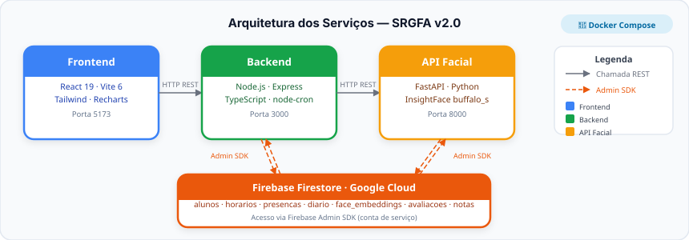
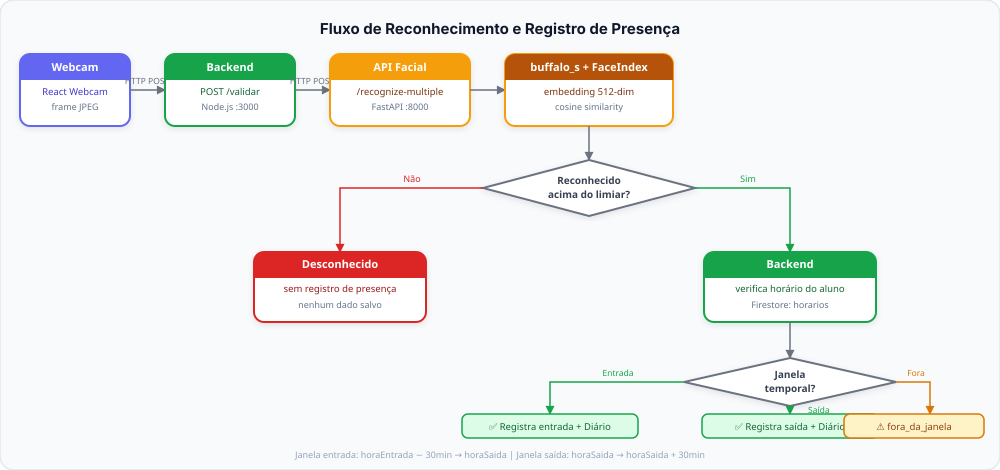
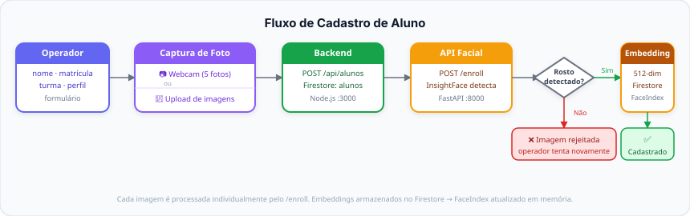
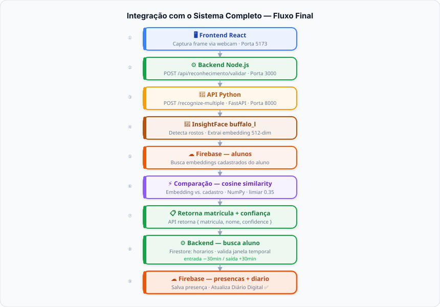

# SISTEMA DE RECONHECIMENTO FACIAL
## PARA ALUNOS DA REDE PÚBLICA DE ENSINO

**Descrição Física, Arquitetural e Tecnológica do Sistema**

Documento Acadêmico — Versão 2.0.0
Itacoatiara — Amazonas — Brasil
Junho de 2026

---

## 1. Introdução

O presente documento tem por finalidade descrever, de forma detalhada, coerente e academicamente fundamentada, a composição física, arquitetural e tecnológica do Sistema de Reconhecimento Facial para Alunos da Rede Pública de Ensino, doravante denominado SRGFA. O sistema foi concebido com o propósito de modernizar e automatizar o controle de presença escolar por meio de técnicas avançadas de visão computacional e aprendizado de máquina, substituindo processos manuais suscetíveis a erros, inconsistências e manipulações por um mecanismo objetivo, rastreável e auditável.

O SRGFA é constituído por três serviços de software independentes, cada qual encapsulado em contêineres Docker e comunicando-se entre si por meio de interfaces HTTP/REST bem definidas. Esta arquitetura de microsserviços garante isolamento de responsabilidades, escalabilidade horizontal e independência tecnológica entre os módulos, de modo que cada componente possa evoluir de forma autônoma sem comprometer a estabilidade dos demais.

O documento está organizado de forma a apresentar, primeiramente, a visão geral da arquitetura do sistema; em seguida, os requisitos de hardware da infraestrutura de hospedagem; e, por fim, uma descrição técnica aprofundada de cada um dos três serviços que compõem o sistema: a API de Reconhecimento Facial, o Backend de Negócios e o Frontend de Apresentação.

---

## 2. Arquitetura Geral do Sistema

A arquitetura do SRGFA segue o padrão de três camadas (Three-Tier Architecture), amplamente adotado em sistemas distribuídos modernos, no qual as responsabilidades de apresentação, lógica de negócios e processamento especializado são segregadas em serviços distintos. A comunicação entre camadas ocorre exclusivamente por meio do protocolo HTTP, utilizando o estilo arquitetural REST para troca de mensagens no formato JSON.

```
┌─────────────────────────────────────────────────────────────────────┐
│ CAMADA DE APRESENTAÇÃO │ Frontend React/TypeScript/Vite             │
│                        │ Contêiner: frontend-presenca-facial        │
│                        │ Porta: 5173  │  Imagem: node:20-alpine     │
└────────────────────────────────────┬────────────────────────────────┘
                                     │ HTTP REST (JSON)
                                     ▼
┌─────────────────────────────────────────────────────────────────────┐
│ CAMADA DE NEGÓCIOS     │ Backend Node.js/Express/TypeScript         │
│                        │ Contêiner: backend-presenca-facial        │
│                        │ Porta: 3000  │  Imagem: node:20-alpine    │
│                        │ Banco: Firebase Firestore (nuvem)         │
└────────────────────────────────────┬────────────────────────────────┘
                                     │ HTTP REST (JSON)
                                     ▼
┌─────────────────────────────────────────────────────────────────────┐
│ CAMADA DE VISÃO COMP.  │ API de Reconhecimento Facial — Python      │
│                        │ Contêiner: api-presenca-facial            │
│                        │ Porta: 8000  │  Motor: InsightFace/buffalo_s│
└─────────────────────────────────────────────────────────────────────┘
```

Cada serviço possui seu próprio Dockerfile, arquivo docker-compose.yml e conjunto de variáveis de ambiente, permitindo que sejam construídos e executados de forma totalmente independente. A coesão do sistema é garantida pela convenção de chave de negócio comum — a matrícula do aluno — que deve ser idêntica em todos os serviços para que o fluxo de reconhecimento resulte no registro correto do cadastro escolar.

---

## 3. Infraestrutura de Hardware

### 3.1 Servidor de Aplicação

Em cenários de implantação típicos de escola pública, os três contêineres Docker são executados em um único servidor físico ou máquina virtual. As especificações mínimas e recomendadas são apresentadas na tabela a seguir:

| Componente          | Especificação Mínima                    | Especificação Recomendada               |
|---------------------|-----------------------------------------|-----------------------------------------|
| Sistema Operacional | Linux (Ubuntu 22.04 LTS)                | Linux Ubuntu 22.04 LTS ou 24.04         |
| Processador         | CPU x86-64 com AVX, 4 núcleos          | Intel i5/Xeon ou AMD Ryzen 5, 8 núcleos |
| Memória RAM         | 8 GB                                    | 16 GB ou mais                           |
| Armazenamento       | SSD 20 GB livres                        | SSD 50 GB livres                        |
| GPU (opcional)      | —                                       | NVIDIA com suporte CUDA (ex.: RTX 3050) |
| Docker Engine       | Versão 24.x ou superior                 | Versão mais recente estável             |
| Rede local          | 100 Mbps (LAN)                          | Gigabit Ethernet                        |

> **Nota sobre GPU:** a API de reconhecimento facial suporta aceleração por GPU NVIDIA via CUDA. A variável de ambiente `FACE_CTX_ID=0` ativa o uso de GPU; `FACE_CTX_ID=-1` força CPU. Quando disponível, a GPU reduz significativamente a latência do reconhecimento facial.

### 3.2 Estação do Operador (Client-Side)

A interação humano-computador ocorre por meio de qualquer estação de trabalho (desktop, notebook ou tablet) com acesso à rede local da instituição. Não há instalação de software adicional no dispositivo do operador — toda a lógica de interface é entregue pelo servidor de front-end. Os requisitos do lado cliente são:

- Câmera digital integrada ou periférica (webcam), com resolução mínima de 640x480 pixels, acessível pelo navegador via API Media Devices da especificação WebRTC;
- Navegador moderno baseado em Chromium (Google Chrome 110+, Microsoft Edge 110+) ou Mozilla Firefox 110+, com suporte a JavaScript ES2022 e à API getUserMedia;
- Conectividade de rede local (LAN ou Wi-Fi) com acesso às portas 5173 (frontend), 3000 (backend) e 8000 (API facial).

---

## 4. Serviço 1 — API de Reconhecimento Facial

A API de Reconhecimento Facial constitui o núcleo algorítmico e computacionalmente mais intensivo do SRGFA. Implementada em Python com o framework FastAPI, é a camada responsável por todo o pipeline de visão computacional: da recepção da imagem bruta até a emissão de um veredito de identidade. O serviço é exposto na porta 8000 e autodocumentado via interface Swagger UI no endpoint `/docs`, permitindo inspeção e testes interativos de todos os recursos.

```
Configuração do contêiner — api-presenca-facial
Contêiner  : api-presenca-facial
Porta      : 8000 → 8000 (host → contêiner)
Framework  : FastAPI + Uvicorn (ASGI)
Motor IA   : InsightFace buffalo_s
Modelo     : /modelos/classificador_match_embeddings_final.pkl
```

### 4.1 Motor de Detecção Facial — InsightFace / buffalo_s

O subsistema de detecção facial é implementado sobre a biblioteca InsightFace, utilizando o modelo **buffalo_s** — versão leve otimizada para inferência em tempo real, com desempenho adequado para uso em CPU e suporte a aceleração por GPU NVIDIA via CUDA. O modelo e seus parâmetros de execução são inteiramente configuráveis via variáveis de ambiente, sem necessidade de alteração no código-fonte. O pipeline opera em três fases sequenciais:

- **Detecção e localização:** uma rede neural convolucional do tipo SCRFD (Sample and Computation Redistribution for Efficient Face Detection) identifica a posição e a caixa delimitadora (bounding box) de cada rosto presente na imagem de entrada, sendo capaz de processar múltiplos rostos simultaneamente em um único frame;
- **Alinhamento geométrico:** os cinco pontos faciais de referência detectados são utilizados para aplicar uma transformação afim que normaliza geometricamente cada rosto, alinhando-o a uma posição canônica de 112×112 pixels, tornando o sistema invariante a rotação e variações de perspectiva;
- **Extração de embedding:** o rosto normalizado é processado por uma rede neural profunda baseada em ArcFace/CosFace, gerando um vetor denso de 512 dimensões que representa de forma compacta e discriminativa as características biométricas únicas do indivíduo.

### 4.2 Comparação de Embeddings

Após a extração dos embeddings, a API realiza a comparação entre o embedding capturado e os embeddings cadastrados, calculando a similaridade por cosseno entre os vetores. O resultado com maior similaridade acima do limiar configurado é retornado como identidade reconhecida. Caso nenhum resultado supere o limiar mínimo, o rosto é classificado como `desconhecido`.

### 4.3 Classificador de Identidade

Sobre os embeddings extraídos pelo InsightFace opera um classificador treinado de forma supervisionada, serializado no formato pickle Python e armazenado no caminho `/modelos/classificador_match_embeddings_final.pkl`. A abordagem adotada é a de aprendizado de métrica por pares (pairwise metric learning): o classificador recebe dois embeddings como entrada e produz uma decisão binária — match (mesmo indivíduo) ou non-match (indivíduos distintos) — juntamente com um escore de confiança numérico.

Os thresholds de decisão são configuráveis via variáveis de ambiente:

| Variável                    | Valor Padrão | Descrição                              |
|-----------------------------|-------------|----------------------------------------|
| `FACE_MATCH_THRESHOLD`      | 0.50        | Limiar principal de aceitação          |
| `FACE_UNKNOWN_THRESHOLD`    | 0.45        | Limiar para rejeição de desconhecidos  |
| `FACE_MIN_COSINE_THRESHOLD` | 0.35        | Similaridade mínima de cosseno         |
| `FACE_STRICT_THRESHOLD`     | 0.65        | Limiar estrito (menor taxa de falsos positivos) |
| `FACE_SENSITIVE_THRESHOLD`  | 0.55        | Limiar sensível (menor taxa de falsos negativos) |

A grande vantagem desta arquitetura híbrida reside em sua capacidade de evolução incremental: o modelo profundo de extração de features não precisa ser retreinado quando novos alunos são cadastrados. Basta coletar novos pares de embeddings e re-executar o pipeline de treinamento do classificador.

### 4.4 Persistência de Dados Biométricos

Os embeddings faciais dos alunos cadastrados são gerenciados diretamente pela API de Reconhecimento Facial, associados à matrícula do aluno (campo `registration`). O cadastro é realizado via endpoint `POST /enroll`, que recebe a imagem, extrai o embedding e o armazena internamente. Cada aluno pode ter múltiplos embeddings (capturados em diferentes ângulos e condições de iluminação), aumentando a robustez do reconhecimento.

### 4.5 Endpoints Disponibilizados

| Método | Endpoint            | Descrição Funcional                                             |
|--------|---------------------|-----------------------------------------------------------------|
| GET    | /                   | Informações básicas do serviço                                  |
| GET    | /health             | Status do serviço, modelo carregado, thresholds e métricas      |
| GET    | /people             | Lista todas as pessoas cadastradas (sem embeddings)             |
| POST   | /enroll             | Cadastrar pessoa: extrai e armazena embedding no Firestore      |
| POST   | /recognize          | Reconhecimento individual: retorna identidade e confiança       |
| POST   | /recognize-multiple | Reconhecimento múltiplo: detecta todos os rostos em um frame    |
| POST   | /compare            | Compara duas imagens e retorna escore de similaridade           |
| DELETE | /people             | Remove todos os cadastros da base facial                        |
| DELETE | /people/{reg}       | Remove o cadastro de uma pessoa específica por matrícula        |
| GET    | /docs               | Interface Swagger UI para inspeção e testes interativos         |

---

## 5. Serviço 2 — Backend de Negócios

O Backend de Negócios é o serviço central de orquestração do SRGFA. Implementado em Node.js com o framework Express e escrito integralmente em TypeScript, este componente atua como intermediador entre o frontend de apresentação e os demais serviços, centralizando todas as regras de domínio da aplicação escolar, a gestão de dados persistentes e a comunicação com a API de reconhecimento facial. O serviço é exposto na porta 3000 e disponibiliza uma rota de verificação de saúde (health check) em `/health`.

```
Configuração do contêiner — backend-presenca-facial
Contêiner  : backend-presenca-facial
Porta      : 3000 → 3000 (host → contêiner)
Imagem     : node:20-alpine
Framework  : Express.js + TypeScript
Banco      : Firebase Firestore (Google Cloud — banco NoSQL em nuvem)
Env vars   : PORT, FRONTEND_URL, FACE_API_URL, GOOGLE_APPLICATION_CREDENTIALS
```

### 5.1 Stack Tecnológica

- **Node.js 20 (LTS):** plataforma de execução JavaScript assíncrona baseada no motor V8, reconhecida pela alta performance em operações de I/O não-bloqueante;
- **Express.js:** framework minimalista para construção de APIs RESTful em Node.js, responsável pelo roteamento, middlewares e serialização de respostas JSON;
- **TypeScript 5.x:** superconjunto tipado de JavaScript com verificação estática de tipos em tempo de compilação;
- **Firebase Admin SDK:** SDK oficial do Google para acesso privilegiado ao Firestore e aos serviços Firebase, utilizando credenciais de conta de serviço;
- **node-cron:** biblioteca para agendamento de tarefas cron no servidor, utilizada para fechamento automático de turnos.

### 5.2 Banco de Dados — Firebase Firestore

O sistema adota o Firebase Firestore como banco de dados principal. As coleções utilizadas pelo sistema são:

| Coleção                    | Descrição                                                          |
|----------------------------|--------------------------------------------------------------------|
| `alunos`                   | Dados cadastrais dos alunos (nome, matrícula, turma, perfil)       |
| `horarios`                 | Grade horária por aluno, dia da semana e turno                     |
| `presencas`                | Registro bruto de cada evento de reconhecimento facial             |
| `diario`                   | Diário Digital oficial com status consolidado por aluno/dia        |
| `justificativas`           | Justificativas de faltas registradas pelo operador                 |
| `avaliacoes`               | Avaliações cadastradas por turma e componente curricular           |
| `notas`                    | Notas parciais por bimestre e aluno                                |
| `objetos_conhecimento`     | Objetos de conhecimento do calendário pedagógico                   |
| `componentes_curriculares` | Componentes curriculares cadastrados por turma                     |

### 5.3 Fechamento Automático de Turnos — node-cron

O backend implementa fechamento automático diário dos turnos por meio de tarefas agendadas com a biblioteca node-cron, considerando o fuso horário `America/Manaus` (UTC-4):

| Turno      | Horário de Fechamento |
|------------|-----------------------|
| Matutino   | 11h15                 |
| Vespertino | 17h15                 |
| Noturno (EJA) | 22h15              |

O fechamento automático consolida o Diário Digital do dia, marcando como ausentes os alunos que não tiveram presença registrada dentro da janela horária do respectivo turno.

### 5.4 Janela de Reconhecimento

O backend implementa uma lógica de janela temporal para controle do salvamento de presenças. Apenas reconhecimentos ocorridos dentro das janelas permitidas resultam em registro de presença:

- **Janela de entrada:** do horário de entrada do aluno menos 30 minutos até o horário de saída;
- **Janela de saída:** do horário de saída até 30 minutos após.

Reconhecimentos fora dessas janelas são retornados com ação `fora_da_janela` e não geram registro no Firestore, preservando a integridade do diário. Alunos sem horário cadastrado retornam ação `sem_horario` e também não têm presença registrada automaticamente.

### 5.5 Segurança de Credenciais

O gerenciamento seguro das credenciais do Firebase é implementado em múltiplas camadas:

- O arquivo `serviceAccountKey.json` é excluído do controle de versão Git via `.gitignore`;
- O `.dockerignore` exclui `secrets/` da camada de build Docker;
- O volume Docker é montado com a flag `:ro` (read-only);
- O arquivo `.env` é excluído do Git e provido apenas em tempo de execução.

### 5.6 Domínios e Rotas de Negócio

| Método | Endpoint                              | Responsabilidade                                                  |
|--------|---------------------------------------|-------------------------------------------------------------------|
| GET    | /health                               | Health check do serviço                                           |
| GET    | /api/alunos                           | Lista todos os alunos cadastrados                                 |
| GET    | /api/alunos/turmas                    | Lista turmas únicas cadastradas                                   |
| GET    | /api/alunos/professores               | Lista professores cadastrados                                     |
| POST   | /api/alunos                           | Cadastrar novo aluno                                              |
| DELETE | /api/alunos/:id                       | Remover aluno                                                     |
| GET    | /api/horarios                         | Lista horários (filtros: aluno, turma, dia)                       |
| POST   | /api/horarios                         | Cadastrar horário                                                 |
| DELETE | /api/horarios/:id                     | Remover horário                                                   |
| GET    | /api/presencas                        | Lista registros de presença                                       |
| POST   | /api/presencas/reconhecimento         | Registrar presença via reconhecimento facial (com imagem)         |
| GET    | /api/diario                           | Diário Digital filtrado por turma/data/turno                      |
| POST   | /api/diario/entrada                   | Confirmar entrada manualmente                                     |
| POST   | /api/diario/saida                     | Confirmar saída manualmente                                       |
| POST   | /api/diario/falta                     | Marcar falta manualmente                                          |
| POST   | /api/diario/justificar                | Justificar falta de um aluno                                      |
| POST   | /api/diario/fechar-dia                | Fechar dia inteiro (todos os turnos)                              |
| POST   | /api/diario/fechar-turno              | Fechar turno específico (matutino, vespertino ou noturno)         |
| GET    | /api/diario/:turmaId/mensal           | Diário mensal de uma turma                                        |
| GET    | /api/dashboard/resumo                 | Resumo do dia: presentes, ausentes, atrasos, percentual           |
| GET    | /api/dashboard/semana                 | Frequência dos últimos 5 dias úteis                               |
| POST   | /api/reconhecimento/validar           | Validar reconhecimento e registrar presença com janela horária    |
| POST   | /api/sincronizacao/limpar-base-facial | Limpar base de dados da API facial (remove todos os embeddings)   |
| GET    | /api/componentes/:turmaId             | Listar componentes curriculares de uma turma                      |
| POST   | /api/componentes                      | Cadastrar componente curricular                                   |
| GET    | /api/objetos-conhecimento/:turmaId    | Listar objetos de conhecimento de uma turma                       |
| POST   | /api/objetos-conhecimento             | Cadastrar objeto de conhecimento                                  |
| DELETE | /api/objetos-conhecimento/:id         | Remover objeto de conhecimento                                    |
| GET    | /api/avaliacoes/:turmaId              | Listar avaliações de uma turma                                    |
| POST   | /api/avaliacoes                       | Criar avaliação                                                   |
| DELETE | /api/avaliacoes/:id                   | Remover avaliação                                                 |
| GET    | /api/notas/:turmaId                   | Listar notas de uma turma                                         |
| POST   | /api/notas                            | Registrar nota parcial                                            |
| PUT    | /api/notas/:id                        | Atualizar nota parcial                                            |

---

## 6. Serviço 3 — Frontend de Apresentação

O Frontend de Apresentação é a interface gráfica do SRGFA, construída como uma Single Page Application (SPA) com React 19, TypeScript 5.8 e Vite 6. Este componente é responsável por toda a experiência do usuário — operador, professor, coordenador ou secretário escolar — oferecendo um conjunto de telas interativas para gerenciamento de cadastros, monitoramento de reconhecimento facial em tempo real, administração do diário digital e acompanhamento de indicadores de frequência.

```
Configuração do contêiner — frontend-presenca-facial
Contêiner  : frontend-presenca-facial
Porta      : 5173 → 5173 (host → contêiner)
Imagem     : node:20-alpine
Framework  : React 19 + TypeScript 5.8 + Vite 6
Env vars   : VITE_BACKEND_URL, VITE_FACE_API_URL
Comando    : npm run dev → vite --host=0.0.0.0 --port=5173
```

### 6.1 Stack Tecnológica

| Biblioteca / Tecnologia | Versão  | Finalidade no Sistema                                      |
|-------------------------|---------|------------------------------------------------------------|
| React                   | 19.0    | Biblioteca de UI declarativa com Hooks                     |
| TypeScript              | ~5.8    | Tipagem estática e segurança de código                     |
| Vite                    | ^6.2    | Bundler com HMR ultrarrápido                               |
| Tailwind CSS            | ^4.1    | Framework CSS utilitário e responsivo                      |
| React Router DOM        | ^7.13   | Roteamento declarativo client-side                         |
| React Webcam            | ^7.2    | Acesso à câmera e captura de frames                        |
| Recharts                | ^3.8    | Gráficos de frequência e dashboard                         |
| Lucide React            | ^0.546  | Ícones SVG vetoriais                                       |
| Sonner                  | ^2.0    | Notificações toast                                         |
| Motion                  | ^12.x   | Animações declarativas                                     |
| date-fns                | ^4.1    | Manipulação e formatação de datas                          |
| clsx + tailwind-merge   | 2.x/3.x | Composição condicional de classes CSS                      |

### 6.2 Módulos Funcionais da Interface

- **Tela de Login:** autenticação do operador com controle de acesso a rotas protegidas via contexto React;
- **Dashboard:** painel de controle com dados em tempo real — cards com total de alunos, presentes, ausentes e atrasos; gráfico de barras da frequência dos últimos 5 dias úteis; gráfico de rosca com distribuição do dia; tabela dos últimos reconhecimentos com entrada, saída, confiança e status. Atualização automática a cada 30 segundos;
- **Tela de Cadastro:** registro de novos alunos com captura de 5 fotos em ângulos distintos (frente, esquerda, direita, cima, baixo) via webcam ou upload de imagens do dispositivo. Dados enviados simultaneamente ao backend (Firestore) e à API facial;
- **Tela de Reconhecimento:** feed de vídeo ao vivo com bounding boxes sobrepostas em tempo real, exibindo nome, escore de confiança e status do reconhecimento. Painel lateral com log cronológico da sessão. Reconhecimentos são salvos apenas dentro da janela horária do aluno;
- **Tela de Horários:** cadastro e gestão de grades horárias por aluno, dia da semana e turno (matutino, vespertino ou noturno EJA). Suporte a múltiplos dias da semana por horário. Dropdown de alunos cadastrados com preenchimento automático. Identificação visual por cores: amarelo (matutino), azul (vespertino), índigo (noturno);
- **Diário Digital:** visão consolidada de frequência por turma e data com os módulos Frequência, Objetos de Conhecimento, Avaliações e Notas Parciais. Ações manuais de confirmar entrada, confirmar saída e registrar falta. Botões de fechamento de turno (matutino, vespertino, noturno);
- **Relatórios:** relatório de frequência com resumo por turma. Exportação em CSV planejada como escopo futuro.

### 6.3 Configuração de Build e Desenvolvimento

O Vite é configurado com os plugins `@vitejs/plugin-react` (JSX/TSX + Fast Refresh) e `@tailwindcss/vite` (integração direta do Tailwind sem PostCSS). O alias `@/` é mapeado para `./src/`. O servidor de desenvolvimento escuta em `0.0.0.0`, essencial para responder a requisições do host dentro do contêiner Docker.

---

## 7. Fluxo de Dados — Ciclo Completo de Reconhecimento de Presença

Para ilustrar a operação integrada do SRGFA, apresenta-se o fluxo completo percorrido durante um evento típico de reconhecimento de presença, desde a captura do frame pela câmera até o registro no banco de dados.

### 7.1 Arquitetura dos Serviços



### 7.2 Fluxo de Reconhecimento e Registro de Presença



Para rostos cujos embeddings não encontrem correspondência acima do limiar de confiança, a API retorna a classificação `desconhecido` e nenhum evento de presença é registrado no Firestore.

### 7.3 Fluxo de Cadastro de Aluno



### 7.4 Integração com o Sistema Completo — Fluxo Final



---

## 8. Sequência de Inicialização e Dependências entre Serviços

O SRGFA deve ser inicializado em uma ordem específica, ditada pelas dependências em tempo de execução entre os serviços:

| # | Serviço                  | Diretório                  | Porta | Depende de        |
|---|--------------------------|----------------------------|-------|-------------------|
| 1 | API de Reconhecimento Facial | ./api-reconhecimento-facial | 8000  | — (nenhum)        |
| 2 | Backend de Negócios      | ./backend                  | 3000  | API Facial (8000) |
| 3 | Frontend de Apresentação | ./frontend                 | 5173  | Backend (3000)    |

Em cada diretório, o comando de inicialização é: `docker compose up --build`. A flag `--build` garante que a imagem Docker seja reconstruída incorporando eventuais alterações no código-fonte.

---

## 9. Segurança, Privacidade e Conformidade com a LGPD

Dado que o SRGFA processa dados biométricos de menores de idade — categoria de dados pessoais sensíveis segundo a Lei Geral de Proteção de Dados Pessoais (LGPD, Lei nº 13.709/2018) —, a implantação e operação do sistema em instituições de ensino público devem observar um conjunto rigoroso de medidas técnicas, organizacionais e jurídicas.

> **Status de implementação:** as medidas listadas nesta seção incluem tanto itens já implementados na versão atual quanto itens planejados para versões futuras. Cada item indica seu estado atual entre colchetes.

### 9.1 Medidas Técnicas de Segurança

| Medida | Descrição | Status |
|--------|-----------|--------|
| Credenciais Firebase | Service Account Key armazenada fora do repositório, protegida por `.gitignore` e `.dockerignore`, montada como volume somente-leitura (`:ro`) | ✅ Implementado |
| Controle de CORS | Variável `FRONTEND_URL` restringe explicitamente as origens autorizadas no Backend | ✅ Implementado |
| Autenticação de operadores | Tela de login com verificação de credenciais; estado de sessão armazenado em localStorage; rotas protegidas com redirect automático para `/login` | ✅ Implementado |
| Tokens JWT | Autenticação stateless com tokens JWT (JSON Web Tokens) para gerenciamento seguro de sessões de operadores | 🔜 Escopo futuro |
| Hash de senhas (bcrypt) | Armazenamento de senhas de operadores com hash criptográfico (bcrypt fator ≥ 10 ou Argon2) | 🔜 Escopo futuro |
| Isolamento de rede | Regras de firewall restringindo acesso às portas 3000, 5173 e 8000 à VLAN pedagógica | 🔜 Planejado (infraestrutura) |
| HTTPS | Certificado TLS para comunicação criptografada em produção | 🔜 Escopo futuro |

### 9.2 Medidas Jurídicas e Organizacionais

- Obtenção de consentimento livre, informado e específico dos responsáveis legais de todos os alunos menores de 18 anos, conforme o artigo 14 da LGPD, antes do cadastro de qualquer dado biométrico;
- Elaboração de Política de Privacidade institucional descrevendo a finalidade do tratamento, o período de retenção e os direitos dos titulares;
- Definição de política de retenção de dados com prazo de manutenção dos embeddings e procedimento de exclusão segura após o encerramento do vínculo escolar;
- Realização de Relatório de Impacto à Proteção de Dados (RIPD) antes da implantação.

---

## 10. Conclusão

O Sistema de Reconhecimento Facial para Alunos da Rede Pública de Ensino representa uma solução tecnológica moderna, modular e de custo operacional reduzido, projetada especificamente para os desafios e restrições do ambiente escolar público brasileiro. Sua arquitetura de três camadas conteinerizadas — API de Reconhecimento Facial em Python/FastAPI/InsightFace buffalo_s, Backend de Negócios em Node.js/Express/TypeScript/Firebase e Frontend em React/TypeScript/Vite — demonstra aderência às melhores práticas contemporâneas de engenharia de software, garantindo independência entre componentes, facilidade de manutenção e capacidade de evolução incremental.

A escolha do Firebase Firestore como banco de dados, tanto para dados escolares quanto para embeddings biométricos, elimina a complexidade operacional da administração de infraestrutura local, aproveitando a escalabilidade e a alta disponibilidade gerenciadas pela Google Cloud Platform. A arquitetura híbrida com InsightFace/buffalo_s para extração de embeddings e um classificador treinável de forma independente oferece equilíbrio adequado entre precisão biométrica, custo computacional e adaptabilidade a novas condições de captura.

---

*Documento elaborado com base nos artefatos técnicos do projeto: Dockerfiles, arquivos docker-compose.yml, código-fonte dos três serviços, READMEs e histórico de branches do repositório.*

*Versão 2.0.0 — Junho de 2026 — Sistema de Reconhecimento Facial para Alunos da Rede Pública de Ensino — SRGFA*
