# Guia do Usuário — SRGFA v2.0.0

**Sistema de Reconhecimento e Gerenciamento de Frequência por Autenticação Facial**
Itacoatiara — Amazonas — Brasil | Junho de 2026

---

## Sumário

1. [Acesso ao Sistema](#1-acesso-ao-sistema)
2. [Dashboard](#2-dashboard)
3. [Cadastro de Aluno](#3-cadastro-de-aluno)
4. [Horários](#4-horários)
5. [Reconhecimento Facial](#5-reconhecimento-facial)
6. [Diário Digital](#6-diário-digital)
   - 6.1 [Frequência](#61-frequência)
   - 6.2 [Objetos de Conhecimento](#62-objetos-de-conhecimento)
   - 6.3 [Avaliações](#63-avaliações)
   - 6.4 [Notas Parciais](#64-notas-parciais)
7. [Relatórios](#7-relatórios)

---

## 1. Acesso ao Sistema

O sistema é acessado pelo navegador no endereço `http://localhost:5173` (ambiente local) ou pelo endereço fornecido pela instituição.

**Passos:**

1. Abra o navegador e acesse o endereço do sistema.
2. Na tela de login, informe o **Usuário** e a **Senha**.
3. Clique em **Entrar**.

> Credenciais padrão para testes: `admin` / `admin`

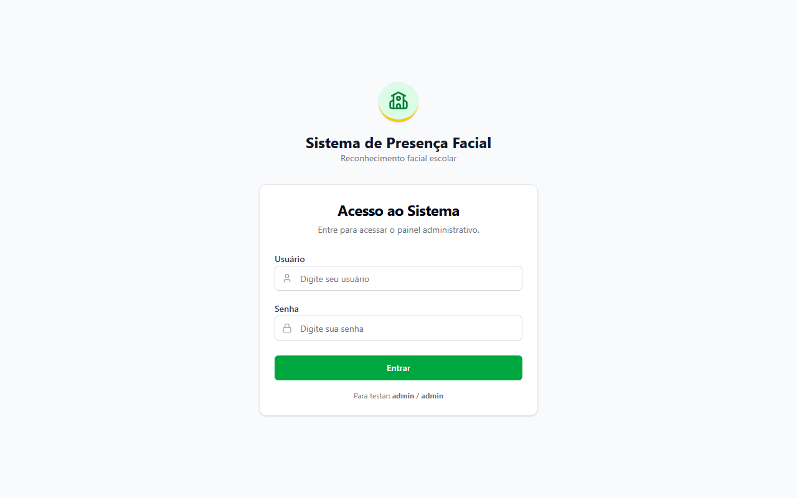

---

## 2. Dashboard

Após o login, o sistema exibe automaticamente o **Dashboard** — painel principal com visão geral do dia letivo em tempo real.

**O que está disponível:**

| Elemento | Descrição |
|---|---|
| **Total de Alunos** | Quantidade de alunos cadastrados no sistema |
| **Presentes** | Alunos com entrada registrada hoje e percentual de frequência |
| **Ausentes** | Alunos sem registro de presença no dia |
| **Atrasos** | Alunos que entraram fora do horário padrão |
| **Gráfico Frequência da Semana** | Barras com presenças dos últimos 5 dias úteis |
| **Distribuição Hoje** | Gráfico de rosca com proporção Presentes / Ausentes / Atrasos |
| **Últimos Reconhecimentos** | Log em tempo real dos reconhecimentos faciais do dia |

> O dashboard atualiza automaticamente a cada **30 segundos**. Para forçar uma atualização imediata, clique no botão **Atualizar** no canto superior direito.

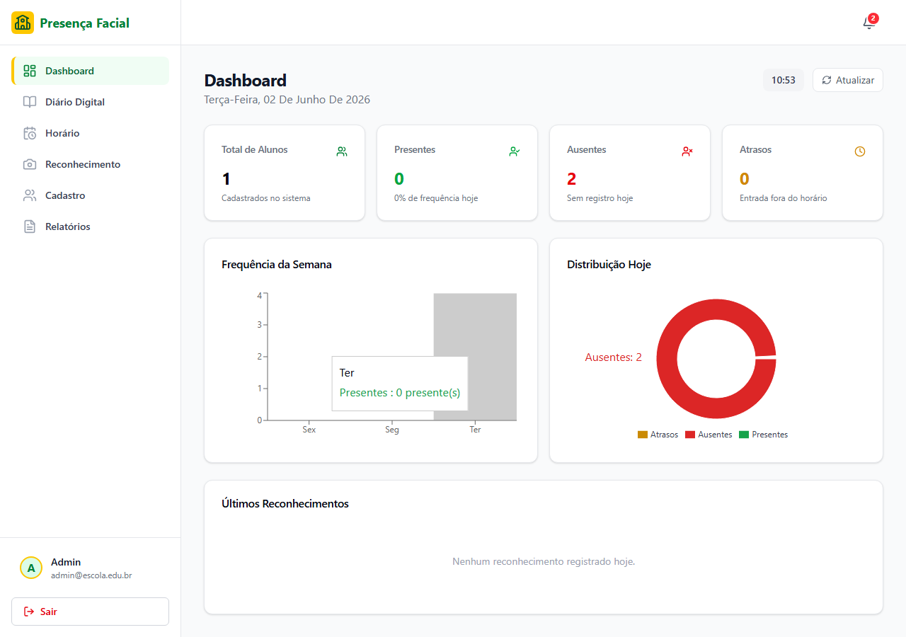

---

## 3. Cadastro de Aluno

O cadastro registra os dados do aluno no Firestore e captura a biometria facial (embeddings) utilizada pelo reconhecimento.

**Passos:**

1. No menu lateral, clique em **Cadastro**.
2. Preencha o formulário à esquerda:
   - **Nome completo**
   - **Perfil** (Aluno, Professor etc.)
   - **Matrícula**
   - **Turma**
3. À direita, registre a biometria facial com uma das duas opções:
   - **Capturar pela câmera** — o sistema solicita 5 fotos em ângulos diferentes (frente, esquerda, direita, cima, baixo). Siga as instruções na tela.
   - **Fazer upload** — selecione 5 imagens do dispositivo.
4. Aguarde as 5 fotos serem capturadas (os quadros na parte inferior ficam preenchidos).
5. Clique em **Salvar Cadastro (5/5 fotos)**.

> **Dicas para melhor reconhecimento:** boa iluminação, olhar diretamente para a câmera, evitar óculos escuros ou bonés.

> Os alunos já cadastrados aparecem na tabela **Alunos cadastrados** na parte inferior da tela. Para excluir um aluno, clique em **Excluir** — isso remove também o cadastro facial da API.

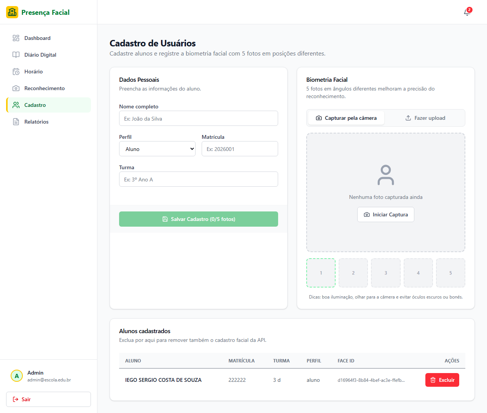

---

## 4. Horários

A tela de **Horário** define a grade horária de cada aluno por dia da semana e turno. Esses horários são usados pelo sistema para validar se um reconhecimento ocorreu dentro da janela permitida.

**Passos para cadastrar um horário:**

1. No menu lateral, clique em **Horário**.
2. No formulário à esquerda:
   - Selecione o **Aluno** no dropdown.
   - Escolha o **Turno** (Matutino, Vespertino ou Noturno).
   - Marque os **Dias da semana** (podem ser múltiplos).
   - Ajuste os horários de **Entrada**, **Limite** e **Saída** se necessário.
3. Clique em **Cadastrar horários**.

> **Janela de reconhecimento:** o sistema aceita a entrada do aluno a partir de 30 minutos antes do horário de entrada até o horário de saída. A saída é aceita do horário de saída até 30 minutos depois. Reconhecimentos fora dessa janela são registrados como `fora_da_janela`.

> Os horários cadastrados aparecem na tabela à direita. Para excluir, clique no ícone de lixeira da linha correspondente.

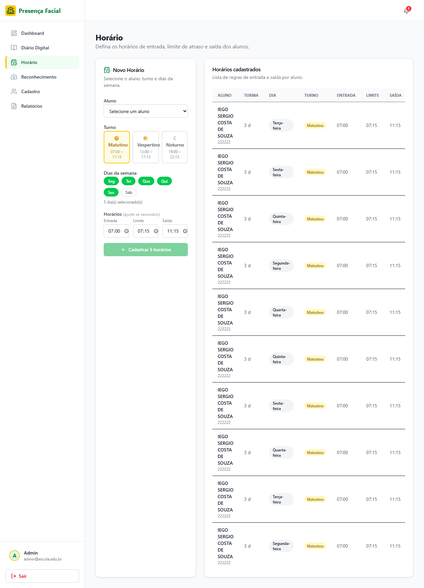

---

## 5. Reconhecimento Facial

A tela de **Reconhecimento** é o coração do sistema: exibe o feed de vídeo ao vivo com detecção facial em tempo real e registra presenças automaticamente.

**Passos:**

1. No menu lateral, clique em **Reconhecimento**.
2. Permita o acesso à câmera quando solicitado pelo navegador.
3. O feed de vídeo ao vivo é exibido na área central. O sistema detecta rostos continuamente e exibe:
   - **Bounding box** ao redor de cada rosto detectado.
   - **Nome e matrícula** do aluno identificado.
   - **Escore de confiança** do reconhecimento.
   - **Status** da presença (Entrada registrada, Saída registrada, Fora da janela etc.).
4. O painel **Log de Acessos** à direita registra cronologicamente todos os reconhecimentos da sessão.

> A presença é salva automaticamente no Firestore quando o reconhecimento ocorre dentro da janela horária cadastrada. Nenhuma ação manual é necessária.

> O indicador **Câmera ativa** (verde) no canto superior direito confirma que o feed está funcionando.

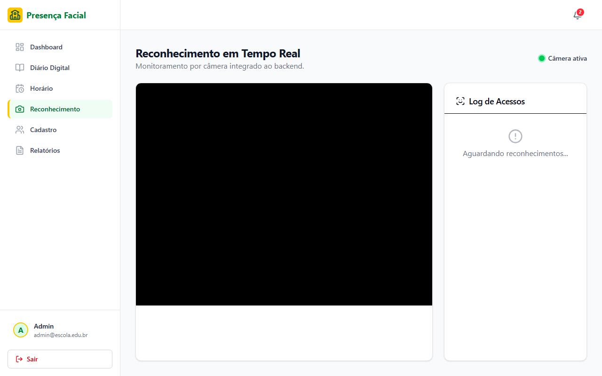

---

## 6. Diário Digital

O **Diário Digital** é o módulo pedagógico central, acessado pelo menu lateral. Ele agrupa quatro submódulos: Frequência, Objetos de Conhecimento, Avaliações e Notas Parciais.

**Para acessar qualquer submódulo:**

1. No menu lateral, clique em **Diário Digital**.
2. Selecione o **Professor** e a **Turma** nos filtros de acesso.
3. Selecione o **Componente Curricular** (disponível após escolher a turma).
4. Clique no card do submódulo desejado.

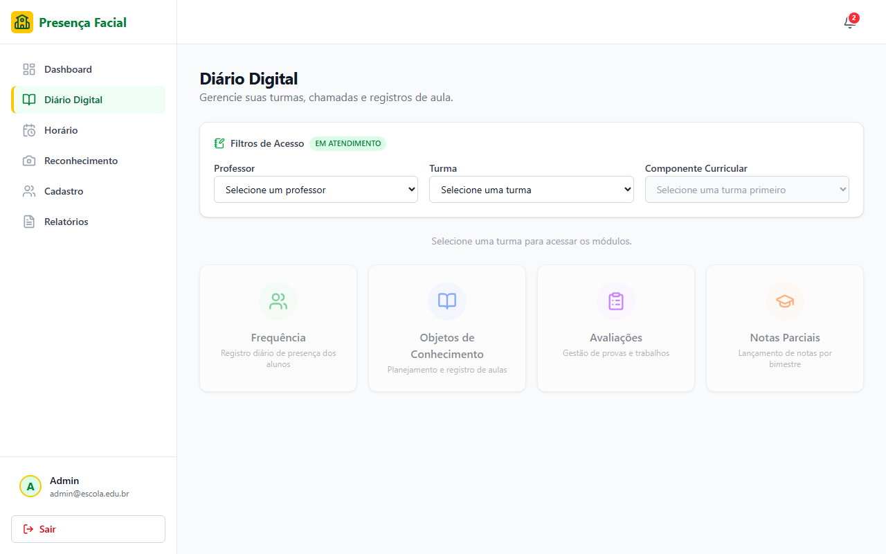

---

### 6.1 Frequência

Exibe a grade de frequência mensal da turma, com status por aluno e por dia letivo.

**Legenda de status:**

| Ícone | Significado |
|---|---|
| ✅ Verde | Presente |
| 🟡 Laranja | Atrasado |
| ❌ Vermelho | Faltou |
| 📦 Amarelo | Justificado |
| ⭕ Azul claro | Hoje (dia atual) |

**Ações disponíveis:**

- **Fechar Matutino / Vespertino / Noturno** — consolida o turno do dia, marcando ausentes os alunos sem registro.
- **Fechar Turma** — fecha todos os turnos do dia para a turma.
- Filtros de **Componente** e **Mês** no topo da tela.

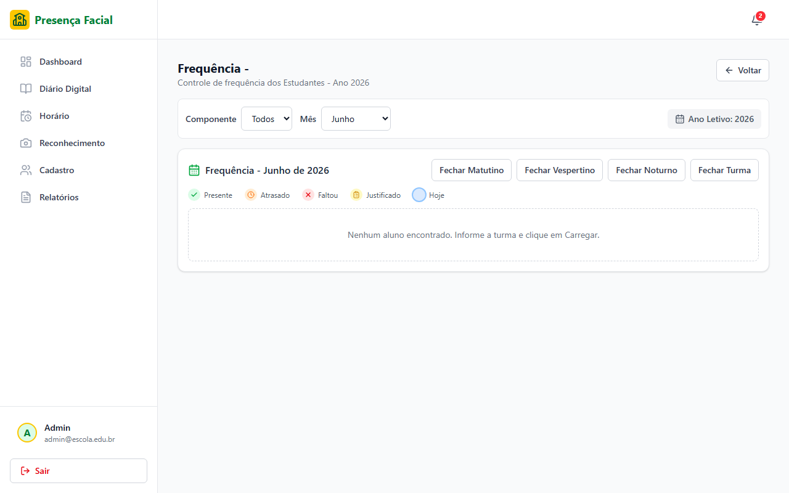

---

### 6.2 Objetos de Conhecimento

Calendário mensal para registro dos conteúdos ministrados em cada dia letivo.

**Como usar:**

1. Navegue para o mês desejado pelo seletor no canto superior direito.
2. Clique em um **dia letivo** no calendário para registrar ou editar o conteúdo ministrado naquele dia.
3. A legenda de cores indica: Dia Letivo (verde), Ministrado (azul), Não Ministrado (vermelho), Evento (cinza).

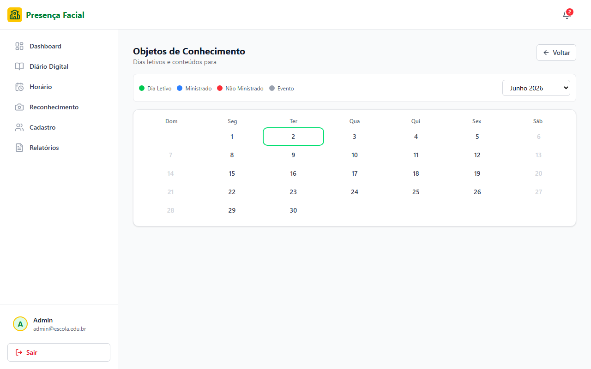

---

### 6.3 Avaliações

Calendário mensal para agendamento e registro de avaliações (provas, trabalhos etc.).

**Como usar:**

1. Navegue para o mês desejado pelo seletor no canto superior direito.
2. Clique em um **dia letivo** no calendário para cadastrar uma avaliação naquele dia.
3. A legenda de cores indica: Dia Letivo (verde), Avaliação agendada (roxo), Evento (cinza).

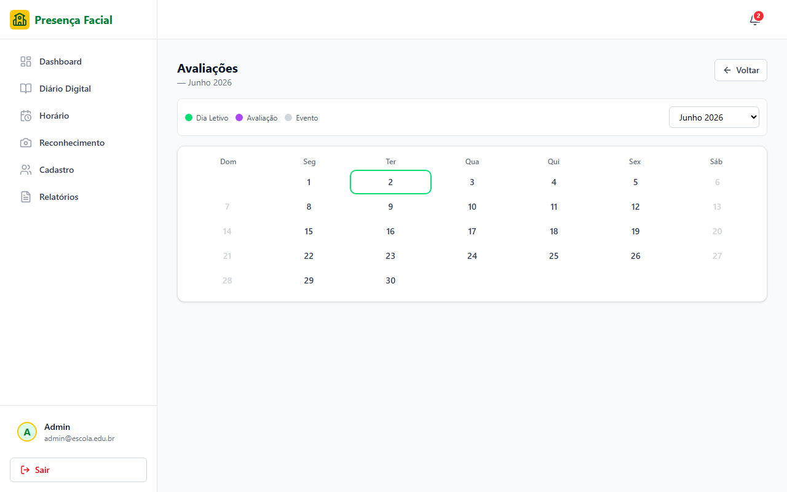

---

### 6.4 Notas Parciais

Grade de lançamento de notas por bimestre, exibindo as avaliações (AV1 a AV4) e a média calculada automaticamente por aluno.

**Como lançar uma nota:**

1. Localize o aluno na grade do bimestre desejado (1º ao 4º bimestre).
2. Clique na **célula** da avaliação (AV1, AV2, AV3 ou AV4) do aluno.
3. Digite a nota e confirme.
4. A média é calculada automaticamente.
5. Use o campo **Buscar aluno** no topo para filtrar por nome.

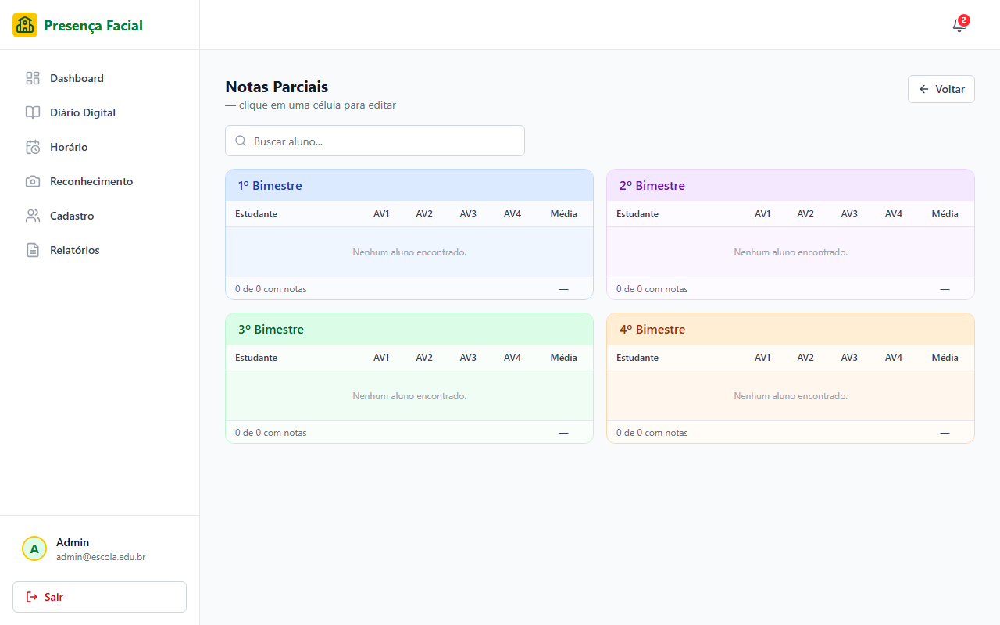

---

## 7. Relatórios

A tela de **Relatórios** agrupa os relatórios acadêmicos e administrativos disponíveis. Relatórios marcados como **Em breve** estão planejados para versões futuras.

**Relatório de Frequência (disponível):**

1. No menu lateral, clique em **Relatórios**.
2. Na seção **Relatórios Acadêmicos**, localize **Relatório de Frequência**.
3. Clique em **Gerar**.
4. O relatório exibe a frequência mensal dos alunos por turma e componente curricular.

> Os demais relatórios (Notas por Turma, Desempenho, Controle de Reunião, Ata Final, Matrículas, Lotação, PSE, Contato) estão sinalizados como **Em breve** e serão habilitados em versões futuras do sistema.

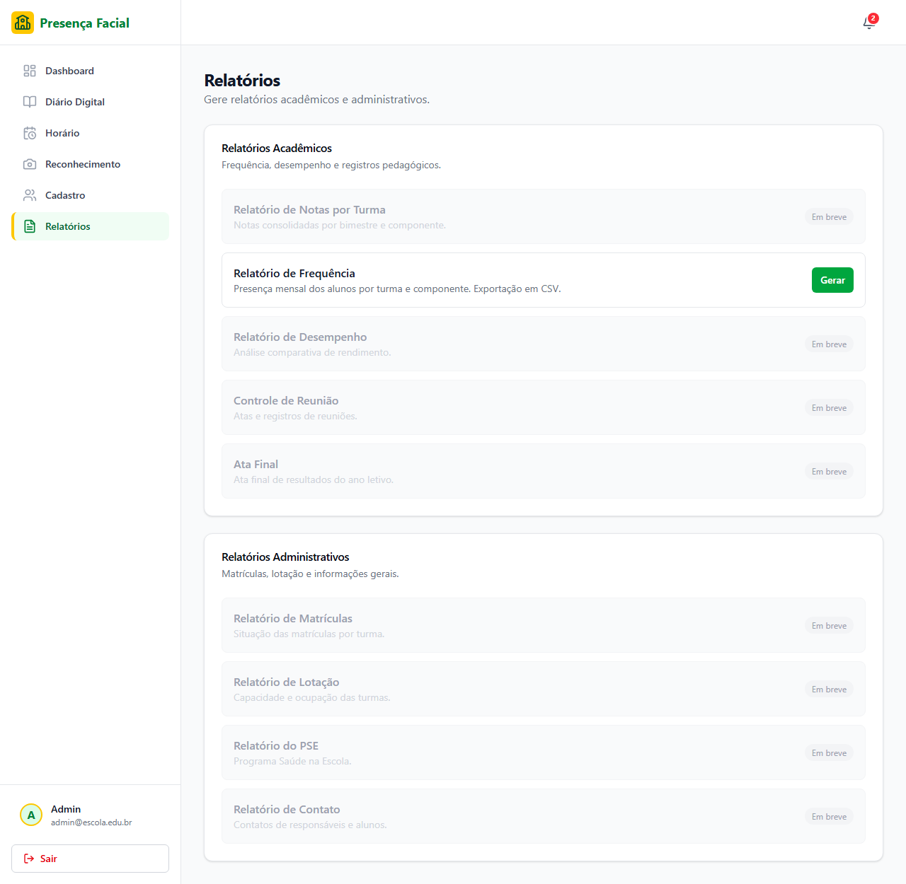

---

*Guia do Usuário — SRGFA v2.0.0 · Junho de 2026*
